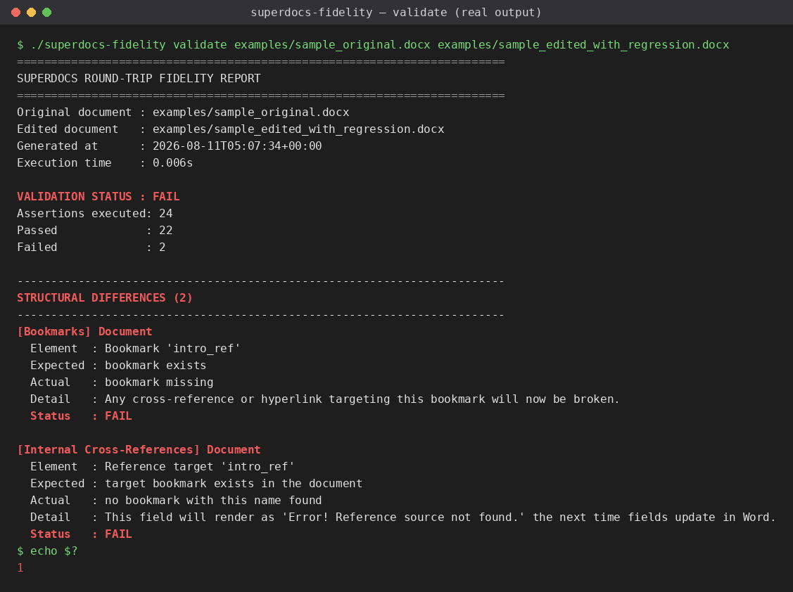

# SuperDocs Round-trip Fidelity Harness

Built for the SuperDocs task. Assigned build: Task 2.1, *"Round-trip
fidelity harness with structural assertions."* Difficulty band S3.



*The screenshot above is a rendered terminal view of the harness's actual,
real output from a real run (`./superdocs-fidelity validate
examples/sample_original.docx examples/sample_edited_with_regression.docx`)
— not a mockup.*

## What this is

A validation suite for anyone whose pipeline ingests Word and must emit
Word. It runs the complete round trip end to end:

1. **Upload** the original `.docx` to SuperDocs
2. **Send an edit instruction** (chat)
3. **Approve** the proposed changes (human-in-the-loop)
4. **Export** the edited document
5. **Structurally validate** the export against the original

...and that last step asserts — structurally, on the real OpenXML package,
never on extracted text, OCR, a PDF, or a screenshot — that the document
survived intact, across all ten categories the assignment specifies:

 1. **Footnotes** — existence, count, ids, references
 2. **Headers** — existence, structure
 3. **Footers** — existence, structure
 4. **Page Number Fields** — field codes, still-functional numbering
 5. **Tracked Changes** — revision entries, authors, timestamps, metadata
 6. **Comments** — existence, author, timestamp, content association
 7. **Equations** — native Word equations stay native, not rasterized
 8. **Bookmarks** — existence, ids
 9. **Internal Cross-References** — still resolve, broken refs detected
10. **Section Geometry** — margins, orientation, paper size, page geometry

Every failure names the exact section and structural element that changed,
what was expected, and what was found instead. The suite runs against
**any** `.docx` — nothing here hardcodes a filename, a template, or a
specific document's structure.

**This is a validation suite, not a document editor, and not a clone of
SuperDocs.**

## Live verification status

**Completed — two independent live round trips, against two different
documents, each investigated at the raw OpenXML level before trusting the
validator's own report.**

### Verification #1 — `examples/sample_original.docx` (2026-08-10)

Upload → edit instruction → HITL approval → export all succeeded against
the real SuperDocs API. `validate` then ran against the real export:
**22 of 24 assertions passed; 2 failed** (Bookmarks, Internal
Cross-References).

Confirmed **genuine regression, not a validator bug**, by grepping the
entire exported package (every part, not just `word/document.xml`) for any
trace of the bookmark or field, and diffing the affected paragraph byte for
byte:

```
$ grep -rl "intro_ref" .                    -> NOT FOUND anywhere
$ grep -rl "bookmarkStart\|bookmarkEnd" .    -> NOT FOUND anywhere
```

SuperDocs' edit pipeline dropped a `<w:bookmarkStart>`/`<w:bookmarkEnd>`
pair and its dependent `REF` field from a paragraph the edit instruction
never asked to touch, collapsing four separate runs into one and leaving a
literal double space where the field used to render. Every other category
— footnotes, comments, tracked changes, native equations, header/footer
wiring, section geometry — survived the same round trip intact.

Full evidence: [`live_verification/FINDINGS.md`](live_verification/FINDINGS.md),
plus the real exported document
([`live_verification/live_edited.docx`](live_verification/live_edited.docx))
and generated reports.

### Verification #2 — `examples/second_document.docx` (2026-08-11)

A second, structurally different document (A4 vs. Letter, 0.75" vs. 1"
margins, a real heading, no footnotes/comments/bookmarks/equations) was run
through the same live round trip. `validate` result: **16 of 17 assertions
passed; 1 failed** (Section Geometry — Section 1 page size).

Confirmed **genuine change made by SuperDocs' export, not a validator false
positive**, with zero XML parsing involved at all — plain `grep` on the raw
unzipped bytes:

```
$ unzip -p examples/second_document.docx word/document.xml | grep -o '<w:pgSz[^/]*/>'
<w:pgSz w:w="11906" w:h="16838" w:orient="portrait"/>

$ unzip -p second_live_edited.docx word/document.xml | grep -o '<w:pgSz[^/]*/>'
<w:pgSz w:w="11909" w:h="16834"/>
```

The page dimensions shifted by +3/-4 twips (+0.05mm / -0.07mm) — real,
measurable, but sub-millimeter, and not a match for any standard page-size
preset (ruling out an accidental Letter/A4/Legal swap). Margins were
byte-identical, so this is isolated to the page-size attributes
specifically, most likely from SuperDocs round-tripping page geometry
through a different internal unit with floating-point rounding on export.

Full evidence: [`live_verification/SECOND_DOCUMENT_FINDINGS.md`](live_verification/SECOND_DOCUMENT_FINDINGS.md),
plus the real exported document
([`live_verification/second_live_edited.docx`](live_verification/second_live_edited.docx))
and generated reports.

### Why the validator was left unchanged in both cases

Both investigations re-read the relevant assertion module's comparison
logic line by line (`assertions/bookmarks.py` and
`assertions/cross_references.py` for #1; `assertions/section_geometry.py`
for #2) to confirm each does a direct, verbatim read of the actual XML
attributes with no unit conversion, rounding, or interpretation that could
manufacture a false result — and then independently re-derived the same
conclusion via raw `grep` on the unzipped bytes, bypassing the validator
(and `lxml`) entirely. Both failures are real. No code in `assertions/`,
`validator/`, or `reporting/` was changed for either finding.

To reproduce or extend this:

```bash
export SUPERDOCS_API_KEY=sk_your_real_key   # never commit this
./superdocs-fidelity run examples/sample_original.docx \
  --instruction "Add a one-sentence executive summary at the top" \
  --cost-cap 1 \
  --small-sample \
  --output live_edited.docx \
  --json-report live_verification_report.json
./superdocs-fidelity validate examples/sample_original.docx live_edited.docx
```

## What this is not

- Not a general-purpose SuperDocs client library. Only the four-call
  contract the assignment names (upload, chat, approve, export) is
  implemented, plus polling. Everything else on the SuperDocs surface
  (templates, multi-document sessions, cross-session memory, ...) is out of
  scope on purpose.
- Not a text-diff tool. The comparison logic never converts either document
  to plain text; see `validator/docx_package.py`.

## Architecture

```
superdocs-fidelity-harness/
├── superdocs_client/     REST client for the 4-call contract + budget guard
│   ├── client.py           upload / chat_async / poll / approve / export
│   ├── budget.py           BudgetGuard: declared cap, estimate, actual spend
│   └── exceptions.py       named, specific error types
├── validator/            Raw OpenXML package access + orchestration
│   ├── docx_package.py     zipfile + lxml over the real .docx parts
│   └── engine.py           runs every assertions/*.py module, times the run
├── assertions/            One module per structural category (10 total)
│   ├── footnotes.py, headers_footers.py, page_fields.py,
│   │   tracked_changes.py, comments.py, equations.py, bookmarks.py,
│   │   cross_references.py, section_geometry.py
│   └── base.py             AssertionResult: assertion/section/element/
│                            expected/actual/status
├── reporting/             ValidationReport -> text / markdown / JSON
├── cli/                   `validate` (local, free) and `run` (live, budgeted)
├── config/                .env-based settings, no hardcoded secrets
└── tests/                 Unit tests, regression tests, CLI smoke tests —
    └── fixtures/            all run with ZERO network access and no API key
```

**Why raw OpenXML instead of python-docx for the validator itself:**
python-docx abstracts away exactly the structures this harness needs to
inspect directly (footnote/comment bodies, bookmark start/end pairing,
tracked-change author/date attributes, header/footer relationship wiring).
`validator/` and `assertions/` use `zipfile` + `lxml` on the real package
parts (`word/document.xml`, `word/footnotes.xml`, `word/comments.xml`,
`word/header*.xml`, `word/_rels/document.xml.rels`, ...) instead. python-docx
is used only as a dependency of convenience for other tooling, never inside
the validation path.

## Installation

```bash
git clone <this repo>
cd superdocs-fidelity-harness
pip install -r requirements.txt
```

That's it for the `validate` subcommand — no API key needed.

For the live round trip (`run`), also:

```bash
cp .env.example .env
# edit .env and set SUPERDOCS_API_KEY (get one at use.superdocs.app -> Settings -> API Keys)
```

## Configuration

All configuration is environment-based (`config/settings.py`), loaded from
real environment variables or a `.env` file (real env vars win). See
`.env.example` for the full list. Nothing here is ever hardcoded or logged.

| Variable | Default | Meaning |
|---|---|---|
| `SUPERDOCS_API_KEY` | — | Required for `run`. Not required for `validate`. |
| `SUPERDOCS_BASE_URL` | `https://api.superdocs.app` | API base URL |
| `SUPERDOCS_REQUEST_TIMEOUT_SECONDS` | `60` | Per-HTTP-call timeout |
| `SUPERDOCS_POLL_INTERVAL_SECONDS` | `2` | Job-status poll interval |
| `SUPERDOCS_MAX_POLL_SECONDS` | `1800` | Give up polling after this long (matches SuperDocs' documented 30-minute processing cap — this is a "stop polling," not a "the job failed," signal) |
| `SUPERDOCS_DEFAULT_COST_CAP` | `5` | Fallback if `--cost-cap` is omitted (CLI still requires it explicitly for `run`) |
| `SUPERDOCS_MODEL_TIER` | `core` | `core` / `turbo` / `pro` / `max` |
| `SUPERDOCS_THINKING_DEPTH` | `balanced` | `fast` / `balanced` / `deep` |
| `SUPERDOCS_SMALL_SAMPLE_CHUNK_LIMIT` | `40` | Chunk-count ceiling enforced by `--small-sample` |

## Running the validator

### Pure structural comparison (no API key, no network)

```bash
./superdocs-fidelity validate original.docx edited.docx
```

Exit code `0` on PASS, `1` on FAIL — safe to drop straight into CI.

Optional flags: `--text-report`, `--json-report`, `--markdown-report` each
write the report to a file in addition to stdout.

### Full live round trip (upload → edit → approve → export → validate)

```bash
./superdocs-fidelity run original.docx \
  --instruction "Add an executive summary at the top" \
  --cost-cap 2 \
  --small-sample \
  --output edited.docx
```

`--cost-cap` is **required** — there is no silent default for a run that can
spend real operations; you must declare a maximum operation cost before any
live call is made. `--small-sample` refuses to run if the document exceeds
`SUPERDOCS_SMALL_SAMPLE_CHUNK_LIMIT` chunks, so you prove the harness out on
a small document before pointing it at a large one, per the assignment's
budget-guard requirement.

Every `run` prints, and every report includes, all three cost figures the
assignment asks for:

- **Declared cost cap** — the `--cost-cap` value itself
- **Estimated cost** — computed pre-flight from the document's chunk count,
  before any billable call is made (`BudgetGuard.check_estimate`, refuses to
  even start if the estimate alone would exceed the cap)
- **Actual cost** — the confirmed `ops_charged` read back from SuperDocs'
  own `usage` block after the edit completes

## Running tests

```bash
pip install -r requirements.txt
pytest
```

Every test — including the regression suite — runs with **zero network
access and no live API key**, per the standard the parent task document
holds every build to. `tests/test_regression.py` deliberately breaks one
structural element per category (a dropped bookmark, a missing footer, an
equation swapped for an image placeholder, a dangling footnote reference, a
stripped comment body, changed section geometry, a file that isn't a valid
`.docx` at all) using hand-authored OpenXML fixtures built in
`tests/fixtures/build_fixtures.py` — no Microsoft Word install required —
and asserts the validator actually catches each one.

## Example output

Try it immediately against the committed example documents — no setup needed:

```bash
./superdocs-fidelity validate examples/sample_original.docx examples/sample_edited_faithful.docx
# -> VALIDATION STATUS : PASS  (exit code 0)

./superdocs-fidelity validate examples/sample_original.docx examples/sample_edited_with_regression.docx
# -> VALIDATION STATUS : FAIL  (exit code 1) -- a bookmark was deliberately removed
```

See [`sample_reports/sample_validation_report.md`](sample_reports/sample_validation_report.md)
for the full report generated by the second command above. Excerpt:

```
VALIDATION STATUS : FAIL
Assertions executed: 24
Passed             : 22
Failed             : 2

------------------------------------------------------------------------
STRUCTURAL DIFFERENCES (2)
------------------------------------------------------------------------
[Bookmarks] Document
  Element  : Bookmark 'intro_ref'
  Expected : bookmark exists
  Actual   : bookmark missing
  Detail   : Any cross-reference or hyperlink targeting this bookmark will now be broken.
  Status   : FAIL

[Internal Cross-References] Document
  Element  : Reference target 'intro_ref'
  Expected : target bookmark exists in the document
  Actual   : no bookmark with this name found
  Detail   : This field will render as 'Error! Reference source not found.' the next time fields update in Word.
  Status   : FAIL
```

## Known limitations

- **Equation-to-image detection is a heuristic, not a proof.** The harness
  can reliably count native `<m:oMath>` objects; it cannot always prove a
  *specific* image was a converted equation, since images can legitimately
  be photos or diagrams. It flags the pattern (oMath count dropped while
  inline image count rose by a comparable amount) as a FAIL for a human to
  confirm, rather than staying silent.
- **Tracked-changes count is not asserted as exactly equal.** A real edit
  legitimately introduces new revisions. The harness asserts every revision
  present has complete metadata (id/author/date) and that revisions present
  in the *original* aren't silently dropped, not that the count never
  changes.
- **The live `run` path was verified end-to-end twice** (2026-08-10 and
  2026-08-11, against two structurally different documents) — see "Live
  verification status" above for both, and
  [`live_verification/FINDINGS.md`](live_verification/FINDINGS.md) /
  [`live_verification/SECOND_DOCUMENT_FINDINGS.md`](live_verification/SECOND_DOCUMENT_FINDINGS.md)
  for full detail. Two confirmed regressions: SuperDocs' edit pipeline can
  drop bookmarks and their dependent `REF` field codes from paragraphs
  outside the literal scope of an edit instruction, and can introduce a
  sub-millimeter page-size drift on export. Every other structural category
  checked out intact on both live runs.
- **Section geometry comparison is positional**, not name-matched — section
  3 in the original is compared against section 3 in the edited document.
  If sections are inserted or removed, the count mismatch is reported as its
  own explicit failure, but the harness doesn't attempt to guess which new
  section "used to be" which old one.
- **Section geometry comparison is an exact match, with no tolerance
  window.** Verification #2 surfaced a real case where this matters: a
  sub-millimeter page-size drift (+3/-4 twips) is flagged as a full FAIL,
  identically to a deliberate page-size change would be. This is a
  deliberate design choice, not an oversight — silently tolerating small
  drift would also silently tolerate the early stages of a larger
  regression — but it does mean the harness cannot currently distinguish
  "invisible rounding noise" from "a real, visible resize" by magnitude
  alone. Adding a configurable tolerance would be a design change, not a
  bug fix, and was left out of scope here.
- **No PDF/HTML export fidelity checking.** The assignment card is
  specifically about DOCX round-trip fidelity; other export formats were
  left out as an intentional scope cut (see `PROGRESS.md`).

## Where this goes

Per the assignment card: a pull request into
`github.com/superdocsapp/superdocs-builds`, under `extensions/`.
